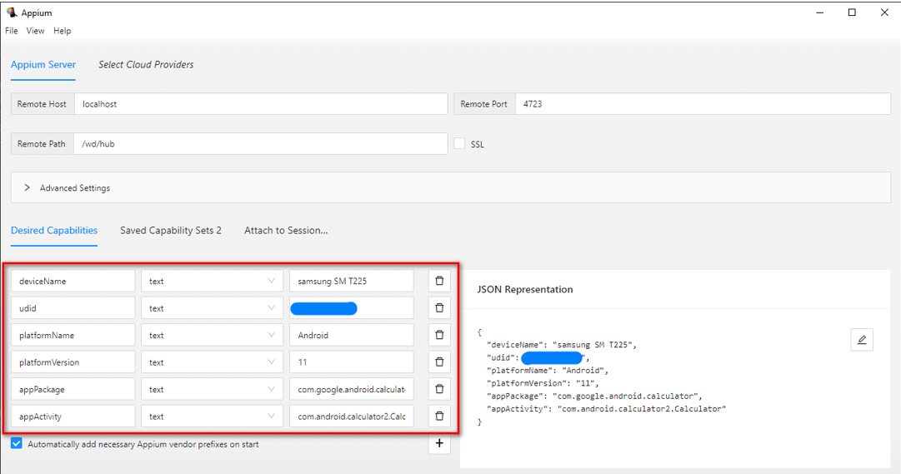

# Prepare Appium Instance for Window 10
To Start Automation with Appium, we have to follow couple of steps.
First we have to make your system ready then we can start our journey with appium.

1. [Download & Install JDK](https://www.oracle.com/java/technologies/javase/jdk11-archive-downloads.html)
2. [Download & Install IntelliJ IDEA Community Version](https://www.jetbrains.com/idea/download/)
3. [Download & Install android studio Android SDK thourgh Android Studio](https://developer.android.com/studio)
4. [Download & Install LTS Node Js](https://nodejs.org/en/download/)
5. [Download & Install Vysor](https://www.vysor.io/download/)
6. [Download & Install Appium Desktop Apps](https://github.com/appium/appium-desktop/releases/)
7. Set environment variable(path) -  Set JAVA_HOME & ANDROID_HOME
8. Check if node.js, npm & Android SDK are installed - node --version, npm --version, adb --version
9. Install appium with node.js - npm install -g appium
10. Check if appium is installed - appium -v
11. Plugin Device (turn on developer mode & USB debugging)    
    -  Find build number under settings and tap 7 times on build number.    
    - Enter your pattern, PIN or password to enable the Developer options menu.    
    - The "Developer options" menu will now appear in your Settings menu.    
    - Turn On the "USB Debugging" option from "Developer Options"
12. Indentify appPackage & appActivityName
    Open the app in your device. and use the command - adb shell "dumpsys activity activities | grep mResumedActivity"
13. **Create TestNG XML** plugin install from Marketplace - File >> Settings >> plugin >> Marketplace >> search 'Create
      TestNG XML' & install
      
##  Create Java(Gradle) Project in IntelliJ IDEA for Appium
1. Create Java(Gradle) Project in IntelliJ IDEA
2. Add Gradle Dependencies   
    - [Selenium](https://mvnrepository.com/artifact/org.seleniumhq.selenium/selenium-java)
    - [Appium CLient](https://mvnrepository.com/artifact/io.appium/java-client)    
     - [TestNG](https://mvnrepository.com/artifact/org.testng/testng)
3. [Desired Capabilities](https://appium.io/docs/en/writing-running-appium/caps/)

## Open existing Java(Gradle) Project using IntelliJ IDEA
1. Open existing Java(Gradle) Project using IntelliJ IDEA   
2. Identify Elements
3. Start Writing Automation Code
4. Run Test Cases

## Appium Inspector to Identify Elements
1. [Appium Inspector download & install](https://github.com/appium/appium-inspector/releases)
2. **Configure Appium Desktop client & Appium Inspector**
  - Appium Desktop
     -  Go to Appium Server GUI -> Advanced
        -  Server address: localhost
        -  Port: 4723
        - Allow CORP: yes
        
 - Appium Inspector
    -  Go to or Open Appium Inspector
        -  Remote host: localhost
        -  Port: 4723
        - Path: /wd/hub
        - Allow Unauthorized Certificates
  - Select your capabilities  
  -  Start Appium Server GUI First 
  -  Appium Inspector server
     
  - Appium Inspector will open 

### Run Test Case
* **Run Test Case** - Go to desired Java Class where has Test Case, Right click of mouse on Test Case >> click on Run
* **Run XML File** - After create TestNG file, Right click of mouse on TestNG xml >> click on Run

### Related Resources
* [Troubleshoot Activities Startup](https://appium.io/docs/en/writing-running-appium/android/activity-startup/)
* [Appium API Documentation](https://appium.io/docs/en/about-appium/api/)
* [Selenium WebDriver](https://www.selenium.dev/documentation/webdriver/)

# Create automated scripts to test EMI Calculator mobile app
[Download & install EMI Calculator mobile app your device](https://github.com/hiromia006/mobileAutomation/blob/main/src/test/resources/emi-calculator.apk)

### Key functionalities, that have to be covered:
1. Open EMI calculator
2. Navigate to the EMI Calculator screen
3. Enter <*loan*> in the amount field
4. Enter <*interest*> percent rate in the interest field
5. Enter <*period*> in the period field in years
6. Enter <*pFee*> percent for the processing fee
7. And tap on the calculate button
8. Then Verify that the detail results are correct <*mEMI*>, <*tInterest*>, <*tpFee*> and <*tPayment*>

#### Examples:

| loan    | interest | period | pFee | mEMI  | tInterest | tpFee | tPayment |
|---------|----------|--------|------|-------|-----------|-------|----------|
|  100000 |  9.0     |  2     |  2.0 |  4568 |  9643     |  2000 |  109643  |
|  325000 |  9.5     |  5     |  1.5 |  6826 |  84536    |  4875 |  409536  |
|  450000 |  11.0    |  7     |  1.8 |  7705 |  197228   |  8100 |  647228  |

### Additional functionalities, that may be covered:
1. Please use Example table data to create excel/csv file as external test data provider and your automation script have the abitlity to read and write data from excel/csv

### Record a video of tests execution:
